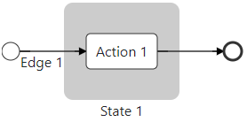
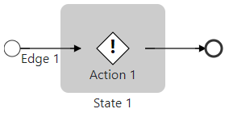

# Neuroglia.Blazor.Dagre
Neuroglia.Blazor.Dagre is a Blazor wrapper and a **customizable** renderer for [dagrejs/dragre][dagrejs/dragre] and, by extension, [dagrejs/graphlib][dagrejs/graphlib]. In other words, it allows graph or diagram data visualisation.


## Preliminary note
This project is not part of [Synapse][Synapse]. During the early development phase, it's more convenient to have it in the same solution.  However, it will be migrated to the [Neuroglia .NET Framework][Neuroglia .NET Framework] when it reaches as satisfying state.

## Get Started
- Add the package reference to your project, ideally using NuGet package manager (not yet available)

- Add a singleton service for `DagreService` in your `Program.cs`

```csharp
// ...
using Neuroglia.Blazor.Dagre;
// ...
var builder = WebAssemblyHostBuilder.CreateDefault(args);
// ...
builder.Services.AddSingleton<IDagreService, DagreService>();
// ...
await builder.Build().RunAsync();
```

- Add dagre javascript file `dagre.min.js` at the end of your  `index.html`'s body, before `blazor.webassembly.js`.

- Add the javascript interop file `neuroglia-blazor-dagre-interop.js` at the end of your  `index.html`'s body, before `blazor.webassembly.js`.

- *(optional but recommanded)* Add the default style `neuroglia-blazor-dagre.min.css` to your `index.html`'s head

```html
<!DOCTYPE html>
<html lang="en">
<head>
    <!-- ... -->
    <link href="_content/Neuroglia.Blazor.Dagre/neuroglia-blazor-dagre.min.css" rel="stylesheet" />
    <!-- ... -->
</head>
<body>
    <!-- ... -->
    <script src="_content/Neuroglia.Blazor.Dagre/lib/dagre/dagre.js"></script>
    <script src="_content/Neuroglia.Blazor.Dagre/neuroglia-blazor-dagre-interop.js"></script>
    <!-- ... -->
    <script src="_framework/blazor.webassembly.js"></script>
</body>
</html>
```

- *(optional but recommanded)* Add `Neuroglia.Blazor.Dagre` namespaces to your global `_Imports.razor`

```csharp
// ...
@using Neuroglia.Blazor.Dagre
@using Neuroglia.Blazor.Dagre.Models
@using Neuroglia.Blazor.Dagre.Templates
// ...
```

- Build and display your graph in a razor file

```csharp
@inject IDagreService Dagre
<DagreGraph Graph="Graph" />
@code {
	public IGraphViewModel Graph = null!;
	protected override async Task OnInitializedAsync()
	{
		await base.OnInitializedAsync();
		var start = new NodeViewModel("", "start-node", NodeShape.Circle, 20, 20);
		var action1 = new NodeViewModel("Action 1");
		var state1 = new ClusterViewModel(
            new Dictionary<Guid, INodeViewModel>() { 
                { action1.Id, action1 }
            }, 
            "State 1"
        );
		var end = new NodeViewModel("", "end-node", NodeShape.Circle, 20, 20);
		var edge1 = new EdgeViewModel(start.Id, action1.Id, "Edge 1");
        var edge2 = new EdgeViewModel(action1.Id, end.Id);
		var nodes = new Dictionary<Guid, INodeViewModel>()
        {
            { start.Id, start },
            { end.Id, end }
        };
		var edges = new Dictionary<Guid, IEdgeViewModel>()
        {
            { edge1.Id, edge1 },
            { edge2.Id, edge2 }
        };
		var clusters = new Dictionary<Guid, IClusterViewModel>()
        {
            { state1.Id, state1 }
        };
		this.Graph = new GraphViewModel(nodes, edges, clusters);
	}
}
```
[](get-started-diagram.png "Sample minimalist diagram")

## Custom templates
You can use custom Razor templates if you'd like to render you own `IGraphElement`, aka `INodeViewModel`, `IClusterViewModel` or  `IEdgeViewModel`.

The renderer will provide two parameters to the component:
- A CascadingParameter IGraphViewModel Graph, the instance of the graph the element belongs to
- A Parameter IGraphElement Element, the instance of the target element.

Let's use a custom component for the `Action` node of the `Get Started` sample
- Create a new Razor Component named `ActionNodeTemplate`

```csharp
@*
 * instead of defining the CascadingParameter Graph and the Parameter Element, 
 * we could inherit from `NodeTemplate` and use either the `Element` property (IGraphElement) or the `Node` property (INodeViewModel).
 * For the sake of the example, we will implement it manually in the @code section

@inherits NodeTemplate 
*@

<g class="node @Node.CssClass" transform="translate(@X, @Y)">
    <g transform="translate(-@HalfHeight, -@HalfHeight)">
        <polygon stroke="black" stroke-width="1" fill="white" points="0,@HalfHeight @HalfHeight,0 @Node.BBox!.Height,@HalfHeight @HalfHeight,@Node.BBox!.Height" />
        <text alignment-baseline="middle" text-anchor="middle" x="@HalfHeight" y="@HalfHeight" font-size="24" font-weight="bold">!</text>
    </g>
    @if (!string.IsNullOrWhiteSpace(Node.Label)) {
        <g class="label">
            <foreignObject 
                x="@BBoxX"
                y="@HalfHeight" 
                width="@Width" 
                height="@Consts.LabelHeight"
            >
                <div>@Node.Label</div>
            </foreignObject>
        </g>
    }
</g>

@code {
    [CascadingParameter]
    public virtual IGraphViewModel Graph { get; set; } = null!;

    [Parameter]
    public virtual IGraphElement Element { get; set; } = null!;

    protected virtual INodeViewModel Node => (INodeViewModel)this.Element;
    protected virtual string? X => this.Node.X.ToInvariantString();
    protected virtual string? Y => this.Node.Y.ToInvariantString();
    protected virtual string? Width => this.Node.BBox.Width.ToInvariantString();
    protected virtual string? Height => this.Node.BBox.Height.ToInvariantString();
    protected virtual string? HalfHeight => (this.Node.BBox.Height / 2).ToInvariantString();
    protected virtual string? BBoxX => this.Node.BBox.X.ToInvariantString();
}
```

- Register the component type for our node

```csharp
var action1 = new NodeViewModel("Action 1")
{
    ComponentType = typeof(ActionNodeTemplate)
};
```
Alternatively, you could create an ActionNodeViewModel that inherits `NodeViewModel` and sets the `ComponentType` in its constructor, or bind the type `ActionNodeViewModel` to it's component via the graph:

```csharp
await this.Graph.RegisterComponentTypeAsync(typeof(ActionNodeViewModel), typeof(ActionNodeTemplate));
```

[](custom-template.png "Sample minimalist diagram")

## Sample app

There is no sample application per se at the moment but the package is used by the [Synapse][Synapse] Dashboard to visualize workflows.


## APIs
### Graph
*Todo*
### Node
*Todo*
### Cluster
*Todo*
### Edge
*Todo*

## Roadmap

- [x] Wrap GraphLib
- [x] Wrap Dagre
- [x] Render nodes
- [x] Render edges
- [x] Render clusters
- [x] Render edge labels
- [ ] Support curved edges
- [x] Support custom templates
- [x] Support SVG definitions
- [x] Support start/end markers for edges
- [x] Support `mousedown`, `mousemove`, `mouseup` events
- [x] Support zoom
- [x] Support pan
- [x] Support center
- [x] Support zoom to fit
- [ ] Support nodes and clusters drag around
  - [x] Move nodes
  - [x] Move clusters
  - [x] Constrain clusters when node moves
  - [ ] Recompute edges path after move
- [ ] ? Add/support more events ?
- [ ] Write proper comments
- [ ] Write proper documentation
- [ ] Write tests

## Contributing

Contributing is more than welcome. Feel free to open issues or pull requests.

[dagrejs/dragre]: https://github.com/dagrejs/dagre "dagrejs/dragre"
[dagrejs/graphlib]: https://github.com/dagrejs/graphlib "dagrejs/graphlib"
[Synapse]: https://github.com/serverlessworkflow/synapse "Synapse"
[Neuroglia .NET Framework]: https://github.com/neuroglia-io/framework "Neuroglia .NET Framework repository"