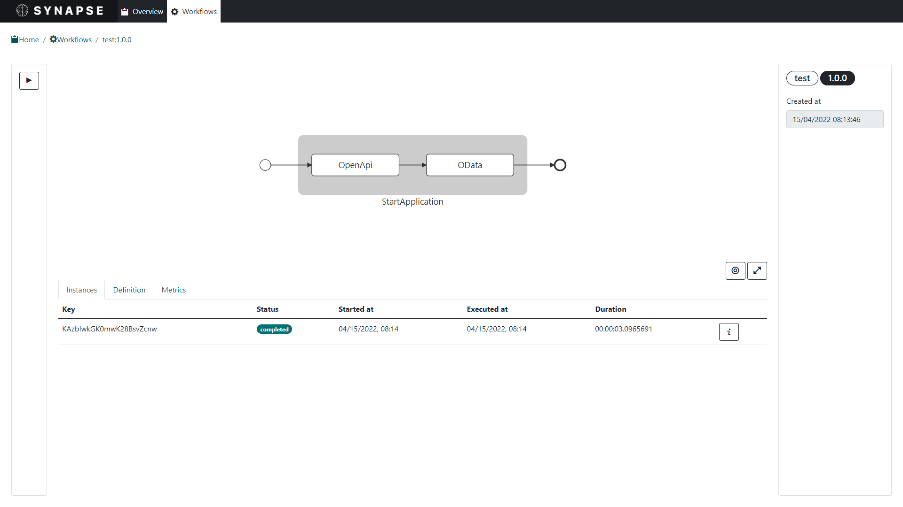

<p align="center">
  
</p>

---

[](https://github.com/serverlessworkflow/synapse/actions/workflows/publish.yml)
[](https://github.com/serverlessworkflow/synapse/releases/latest)
[](https://github.com/serverlessworkflow/synapse/releases/latest)
[](https://github.com/serverlessworkflow/synapse/commits/)
[](https://github.com/serverlessworkflow/synapse/commits/)
[](https://github.com/serverlessworkflow/synapse/blob/main/LICENSE)

## About

Synapse is a vendor-neutral, free, open-source, and community-driven Workflow Management System (WFMS) implementing the [Serverless Workflow specification](https://github.com/serverlessworkflow/specification).

## Requirements

- [.NET 6](https://dotnet.microsoft.com/en-us/download/dotnet/6.0) or later

*Optionally, and depending on which flavor of the Synapse Server you chose to run, you might require:*

- [Docker](https://www.docker.com/)
- [Kubernetes](https://kubernetes.io/)

## Quick start

**1. Download and extract synctl:**

*On Windows*:

```
wget https://github.com/serverlessworkflow/synapse/releases/latest/download/synctl-win-x64.zip
tar -xf synctl-win-x64.zip
```

*On Linux*:

```
wget https://github.com/serverlessworkflow/synapse/releases/latest/download/synctl-linux-x64.tar.gz
tar -xf synctl-linux-x64.tar.gz
```

*On Mac OSX*:

```
wget https://github.com/serverlessworkflow/synapse/releases/latest/download/synctl-osx-x64.tar.gz
tar -xf synctl-osx-x64.tar.gz
```

**2. Install Synapse:**

*Natively*:

```
synctl system install native
```

*On Docker*:

```
synctl system install docker
```

*On Kubernetes*:

```
synctl system install kubernetes
```

**3. Have fun!**

## Server

### Installing

#### Native

The Synapse Server can run natively on Windows, Mac and Linux, without any dependencies aside from .NET. Even though it is the easier way to get started, it should only be used for tests purposes. For production, you should prefer the Docker or Kubernetes based setups.

To get started, just download the appropriate [release](https://github.com/serverlessworkflow/synapse/releases/latest) for your system, then start it using the following command:

```shell
dotnet run ./Synapse.Server.dll
```

For more information on how to configure a Native Synapse Server, please read the [docs](https://github.com/serverlessworkflow/synapse/wiki).

#### Docker

Docker is the recommended way to run the Synapse Server for those who do not want to host it on a Kubernetes cluster.

To run the server on Docker, simply execute the following command in your system's shell:

```shell
docker run --name synapse -v /var/run/docker.sock:/var/run/docker.sock -p 42286:42286 -p 41387:41387 ghcr.io/serverlessworkflow/synapse:latest
```

*Notes: you need to mount the `docker.sock` and/or run the container with the `--network host` option for Synapse to be able to spawn its own containers*

For more information on how to configure Synapse for Docker, please read the [docs]().

#### Docker-Compose

Docker-Compose helps you to get started easier and faster than with Docker, as it allows to declare and configure multiple container at once, which will likely be needed if using persistence, for instance.

To run the server on Docker-Compose, simply execute the following command in your system's shell:

```shell
docker-compose -f deployment/docker-compose/docker-compose.yml up -d
```

Alternatively, you can use the file using EventStore and MongoDB powered persistence:

```shell
docker-compose -f deployment/docker-compose/eventstore+mongo.yml up -d
```

#### Kubernetes

Kubernetes is the preferred way to run the Synapse Server, as it offers a wide range of tools to configure, run and manage multiple containers at once, which will likely be needed if using persistence, for instance.

To run the server on Kubernetes, simply execute the following command in your system's shell:

```shell
kubectl apply -f deployment/kubernetes/stand-alone.yaml
```

Alternatively, you can use the file using EventStore and MongoDB powered persistence:

```shell
kubectl apply -f deployment/kubernetes/eventstore+mongo.yaml
```

## User Interfaces

Synapse provides 2 different UIs for interacting with the server:

### GUI
<p align="center">
  
</p>
The `Dashboard` is a Blazor Web Assembly (WASM) Graphical User Interface (GUI) that comes bundled with the Synapse Server. 

To get started, simply open a web browser and navigate to the Synapse Server's base url.

For more information on how to use the `Dashboard`, please read the [docs](https://github.com/serverlessworkflow/synapse/wiki).

### CLI

`synctl` is a Command Line Interface (CLI) used to interact with the Synapse Server. 

To get started, just download the appropriate [release](https://github.com/serverlessworkflow/synapse/releases/latest) for your system, then type the following command:

```shell
synctl --help
```

For more information on how to use `synctl`, please read the [docs](https://github.com/serverlessworkflow/synapse/wiki).

## Application Programing Interfaces

The Synapse Server is shipped with 3 different APIs, each addressing a different use-case. All the implementations of those APIs are supplied with their respective client library.

### Management API

The Synapse Management API is used to manage workflows and their instances.

Implementations:

- [x] HTTP REST
- [x] [GRPC](https://github.com/grpc/grpc-dotnet)
- [ ] WebSockets ([SignalR](https://github.com/dotnet/aspnetcore/tree/main/src/SignalR))

### Monitoring API

The Synapse Monitoring API is used for real-time observability of workflows and their instances. It is used by the Dashboard to enable real-time updates.

Implementations:

- [ ] [GRPC](https://github.com/grpc/grpc-dotnet)
- [x] WebSockets ([SignalR](https://github.com/dotnet/aspnetcore/tree/main/src/SignalR))

### Runtime API

The Synapse Runtime API is used by workers to run workflows and maintain their state. It preferably should not be used by anything else than runtime executors.

Implementations:

- [x] [GRPC](https://github.com/grpc/grpc-dotnet)
- [ ] WebSockets ([SignalR](https://github.com/dotnet/aspnetcore/tree/main/src/SignalR))

## Community

We have a growing community working together to build a community-driven and vendor-neutral
workflow ecosystem. Community contributions are welcome and much needed to foster project growth.

See [here](community/contributors.md) for the list of community members that have contributed to the specification.

To learn how to contribute to the specification reference the ['how to contribute'](CONTRIBUTING.md) doc.

If you have any copyright questions when contributing to a CNCF project like this one,
reference the [Ownership of Copyrights in CNCF Project Contributions](https://github.com/cncf/foundation/blob/master/copyright-notices.md) doc.

### Code of Conduct

As contributors and maintainers of this project, and in the interest of fostering
an open and welcoming community, we pledge to respect all people who contribute
through reporting issues, posting feature requests, updating documentation,
submitting pull requests or patches, and other activities.

We are committed to making participation in this project a harassment-free experience for
everyone, regardless of level of experience, gender, gender identity and expression,
sexual orientation, disability, personal appearance, body size, race, ethnicity, age,
religion, or nationality.

See our full project Code of Conduct information [here](CODE-OF-CONDUCT.md).

## Repository Structure

Here is the outline of the repository to help navigate the specification
documents:

| File/Directory | Description | 
| --- | --- | 
| [LICENSE](LICENSE) | Specification License doc | 
| [OWNERS](OWNERS.md) | Defines the current maintainers and approvers | 
| [MAINTAINERS](MAINTAINERS.md) | Project Maintainers Info | 
| [GOVERNANCE](GOVERNANCE.md) | Project Governance Info | 
| [CONTRIBUTING](CONTRIBUTING.md) | Documentation on how to contribute to the project | 
| [CODE-OF-CONDUCT](code-of-conduct.md) | Defines the project's Code of Conduct | 
| [ROADMAP](https://github.com/serverlessworkflow/synapse/milestones) | Project Roadmap |
