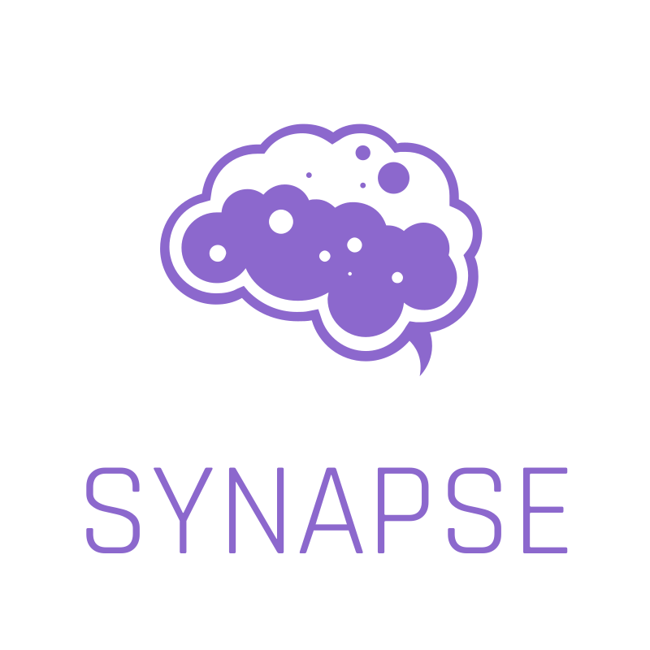

  

---

## About

Synapse is a vendor-neutral, open-source, and community-driven Workflow Management System (WFMS) designed to implement the [Serverless Workflow specification](https://github.com/serverlessworkflow/specification). 

It enables developers and organizations to define and execute workflows effortlessly using a high-level, intuitive Domain Specific Language (DSL). 

With Synapse, you can create powerful workflows that are cloud vendor-agnostic, easily scalable, and highly customizable.

### Features

- **Easy to Use**: The Serverless Workflow DSL is designed for universal understanding, enabling users to quickly grasp workflow concepts and create complex workflows effortlessly.
- **Event Driven**: Seamlessly integrate events into workflows with support for various formats, including CloudEvents, allowing for event-driven workflow architectures.
- **Service Oriented**: Integrate seamlessly with service-oriented architectures, allowing workflows to interact with various services over standard application protocols like HTTP, gRPC, OpenAPI, AsyncAPI, and more.
- **FaaS Centric**: Invoke functions hosted on various platforms within workflows, promoting a function-as-a-service (FaaS) paradigm and enabling microservices architectures.
- **Timely**: Define timeouts for workflows and tasks to manage execution duration effectively.
- **Fault Tolerant**: Easily define error handling strategies to manage and recover from errors that may occur during workflow execution, ensuring robustness and reliability.
- **Schedulable**: Schedule workflows using CRON expressions or trigger them based on events, providing control over workflow execution timing.
- **Interoperable**: Integrates seamlessly with different services and resources.
- **Robust**: Offers features such as conditional branching, event handling, and looping constructs.
- **Scalable**: Promotes code reusability, maintainability, and scalability across different environments.
- **Cross-Platform**: Runs on various operating systems, providing flexibility and ease of integration.

### Microservices

Synapse is composed of several specialized applications, allowing for atomic scalability, resilience, and ease of maintenance:

- **API Server**: Serves an HTTP API to manage Synapse resources, and optionally serves the **Dashboard**, which is Synapse's Graphical User Interface.
- **Operator**: Controls workflows and workflow instances, and starts workflow runners.
- **Runner**: Executes a single instance of a workflow.
- **Correlator**: Performs Complex Event Processing (CEP) and correlates ingested events.
- **CLI**: Allows interaction with the Synapse API via the command line interface.

## Getting Started

## Community

We have a growing community working together to build a community-driven and vendor-neutral
workflow ecosystem. Community contributions are welcome and much needed to foster project growth.

See [here](community/contributors.md) for the list of community members that have contributed to the specification.

To learn how to contribute to the specification reference the ['how to contribute'](contributing.md) doc.

If you have any copyright questions when contributing to a CNCF project like this one,
reference the [Ownership of Copyrights in CNCF Project Contributions](https://github.com/cncf/foundation/blob/master/copyright-notices.md) doc.

### Code of Conduct

As contributors and maintainers of this project, and in the interest of fostering
an open and welcoming community, we pledge to respect all people who contribute
through reporting issues, posting feature requests, updating documentation,
submitting pull requests or patches, and other activities.

We are committed to making participation in this project a harassment-free experience for
everyone, regardless of level of experience, gender, gender identity and expression,
sexual orientation, disability, personal appearance, body size, race, ethnicity, age,
religion, or nationality.

See our full project Code of Conduct information [here](code-of-conduct.md).
